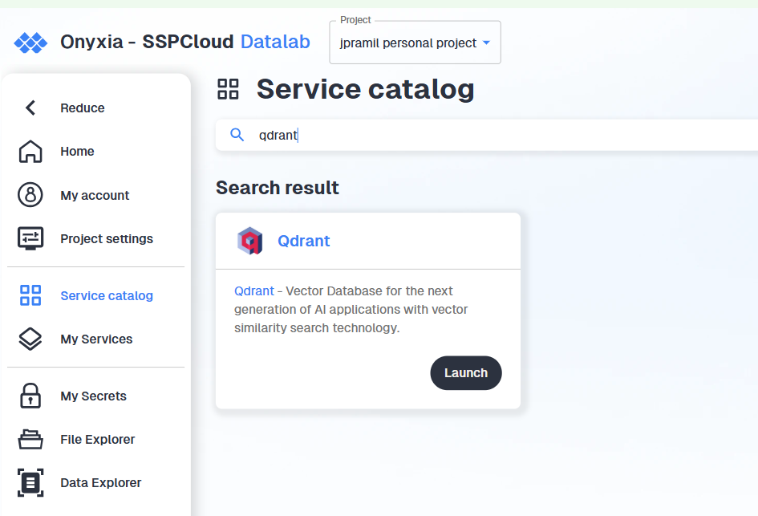

# Goal of this tutorial

This tutorial is inspired by subject 2 of the 2026 funathon. See its dedicated website: [https://aiml4os.github.io/funathon-project2/](https://aiml4os.github.io/funathon-project2/).

This tutorial shows a Retrieval-Augmented Generation (RAG) pipeline for an automatic-coding use case: recoding free-text descriptions of economic activities into the new NACE 2.1 nomenclature. The whole pipeline runs end-to-end on the SSPCloud (Insee's open-source data-science platform): a Qdrant vector database for retrieval, the `llm.lab` gateway for embeddings and generation, and S3 / MinIO for the data. The same recipe applies to any statistical nomenclature or controlled vocabulary, and to any environment that exposes an OpenAI-compatible LLM endpoint and a Qdrant instance.

Compared to the more pedagogical [funathon-project2](https://github.com/AIML4OS/funathon-project2) tutorial, this notebook is direct: every step of the RAG pipeline is shown with its working code, without question/answer scaffolding.

## Why RAG for recodification?

When a classification is revised (NACE 2.0 → NACE 2.1, COICOP, ISCO, …), the legacy training labels are in the wrong space and a new manual-annotation campaign large enough to retrain a classifier from scratch typically does not yet exist. Asking an LLM to recode from memory is fragile: it confuses adjacent codes, hallucinates codes that do not exist, or mixes up versions of the classification.

RAG splits the task in two:

1. **Retrieve**: find the NACE 2.1 codes whose definitions are semantically closest to the activity label, using a vector database.
2. **Generate**: ask an LLM to pick the best code *from the retrieved shortlist*, not from memory.

The knowledge about the nomenclature lives in the vector store, not in the LLM weights. Updating to the next revision means re-indexing, not retraining.

## What this notebook covers

Stage 1: build the vector database once (§3).

```{mermaid}
flowchart LR
    A[Raw NACE 2.1] --> B[NaceDocument]
    B --> C[Embedding]
    C --> D[(Qdrant collection)]
```

Stage 2: query the vector database for each activity label, then score the pipeline (§4 and §5).

```{mermaid}
flowchart LR
    L[Activity label] --> E[Embed]
    E --> R[Retrieve top-k]
    D[(Qdrant)] -. query .-> R
    R --> P[Build prompt]
    P --> G[LLM JSON output]
    G --> M[Evaluation metrics]
```

The activity-label evaluation dataset is reused as-is from funathon-project2 (English labels generated by an agentic AI system at low temperature).

# Technical requirements

## Services

| Service | Role |
|---------|------|
| **Qdrant** | Vector database storing NACE 2.1 embeddings |
| **llm.lab** | LLM provider (embedding model + generative model) |

## Credentials

Create a `.env` file at the root of the repository with the following variables:

```txt
QDRANT_URL=https://YOURNAMESPACE-qdrant.user.lab.sspcloud.fr/
QDRANT_API_KEY=xxxxxxxxxxxxxxxxxxxx
QDRANT_API_PORT=443
LLMLAB_API_KEY=xxxxxxxxxxxxxxxxxxxx
LLMLAB_URL=https://llm.lab.sspcloud.fr/api
```

::: {.callout-warning}
Never commit your `.env` file. It is already listed in `.gitignore`. Leaking API keys can expose your services to unauthorised use.
:::

### Getting your llm.lab API key

1. Go to the llm.lab interface and sign in with your SSPCloud account.
2. Open **Settings** (top right) → **Account** → **API Keys**.
3. Generate a new key and copy it into `LLMLAB_API_KEY`.


### Getting your Qdrant credentials

1. Launch a **Qdrant** service in your personal SSPCloud namespace.



2. Copy the generated token and save it as `QDRANT_API_KEY`. The URL follows the pattern `https://YOURNAMESPACE-qdrant.user.lab.sspcloud.fr/`.


## Loading credentials in Python

```python
from dotenv import load_dotenv
load_dotenv()
```

To verify a variable was loaded:

```python
import os
try:
    QDRANT_URL = os.environ["QDRANT_URL"]
    print("QDRANT_URL loaded successfully")
except KeyError:
    raise ValueError("QDRANT_URL is not set; check your .env file")
```

# Build the vector database

## Connections

```{python}
#| label: connections
#| output: true

import os
from dotenv import load_dotenv
from openai import OpenAI
from qdrant_client import QdrantClient

load_dotenv()

client_llmlab = OpenAI(
    base_url=os.environ["LLMLAB_URL"],
    api_key=os.environ["LLMLAB_API_KEY"],
)

client_qdrant = QdrantClient(
    url=os.environ["QDRANT_URL"],
    api_key=os.environ["QDRANT_API_KEY"],
    port=os.environ["QDRANT_API_PORT"],
)

print("Available llm.lab models:")
for model in client_llmlab.models.list().data:
    print(f"  - {model.id}")
```

## Load the NACE 2.1 nomenclature

The official NACE 2.1 structure (codes, headings, hierarchy, *Includes* / *Excludes* notes) is pulled from S3 / MinIO.

```{python}
#| label: load-nace
#| output: true

import duckdb

PATH_NACE = (
    "https://minio.lab.sspcloud.fr/projet-formation/diffusion/funathon/2026"
    "/project2/NACE_Rev2.1_Structure_Explanatory_Notes_EN.tsv"
)

con = duckdb.connect(database=":memory:")
con.execute("INSTALL httpfs; LOAD httpfs;")
nace = con.execute(f"SELECT * FROM read_csv('{PATH_NACE}')").fetch_arrow_table().to_pylist()

print(f"Loaded {len(nace)} NACE 2.1 entries")
print({k: nace[22][k] for k in ("CODE", "HEADING", "LEVEL")})
```

## `NaceDocument`: clean text + embedding + Qdrant point

One class carries every step from raw row to Qdrant point. The `text` field is what the embedding model sees; the `payload` is what retrieval returns.

```{python}
#| label: nace-document
#| output: true

from dataclasses import dataclass, field
from typing import Optional, List
from uuid import uuid5, NAMESPACE_DNS

from qdrant_client.models import PointStruct

NACE_NAMESPACE = uuid5(NAMESPACE_DNS, "nace-rev2.1")


def _clean(value) -> Optional[str]:
    if value is None:
        return None
    cleaned = " ".join(str(value).replace("\n", " ").split())
    return cleaned or None


@dataclass
class NaceDocument:
    code: str
    heading: str
    level: int
    parent_code: Optional[str] = None
    includes: Optional[str] = None
    includes_also: Optional[str] = None
    excludes: Optional[str] = None

    text: str = field(init=False)
    vector: Optional[List[float]] = field(default=None, init=False)

    @classmethod
    def from_raw(cls, raw: dict, *, with_includes_also: bool = True, with_excludes: bool = True) -> "NaceDocument":
        for key in ("CODE", "HEADING", "LEVEL"):
            if not raw.get(key):
                raise ValueError(f"Missing required field: {key}")
        level = int(raw["LEVEL"])
        if not (1 <= level <= 4):
            raise ValueError(f"Invalid level: {level}")

        obj = cls(
            code=str(raw["CODE"]).strip(),
            heading=_clean(raw["HEADING"]),
            level=level,
            parent_code=_clean(raw.get("PARENT_CODE")),
            includes=_clean(raw.get("Includes")),
            includes_also=_clean(raw.get("IncludesAlso")),
            excludes=_clean(raw.get("Excludes")),
        )
        obj.text = obj.to_embedding_text(with_includes_also=with_includes_also, with_excludes=with_excludes)
        return obj

    def to_embedding_text(self, *, with_includes_also: bool = True, with_excludes: bool = True) -> str:
        parts = [f"# Code: {self.code}", f"# Title: {self.heading}"]
        if self.includes:
            parts += ["", "## Includes:", self.includes.strip()]
        if with_includes_also and self.includes_also:
            parts += ["", "## Also includes:", self.includes_also.strip()]
        if with_excludes and self.excludes:
            parts += ["", "## Excludes:", self.excludes.strip()]
        return "\n".join(parts).replace("\\n", "\n").strip()

    def get_embedding(self, client_llmlab, emb_model: str) -> List[float]:
        response = client_llmlab.embeddings.create(model=emb_model, input=self.text)
        self.vector = response.data[0].embedding
        return self.vector

    def to_qdrant_point(self) -> PointStruct:
        if self.vector is None:
            raise ValueError(f"Vector is missing for code {self.code}")
        return PointStruct(
            id=str(uuid5(NACE_NAMESPACE, self.code)),
            vector=self.vector,
            payload={
                "code": self.code,
                "level": self.level,
                "parent_code": self.parent_code,
                "text": self.text,
            },
        )


nace_documents = [NaceDocument.from_raw(raw) for raw in nace]
print(f"Built {len(nace_documents)} NaceDocument objects")
print("\nExample text (used as embedding input):\n")
print(nace_documents[50].text)
```

## Create the Qdrant collection

```{python}
#| label: qdrant_vars
#| include: false
EMB_MODEL = "qwen3-embedding-8b"
EMB_DIM = 4096
COLLECTION_NAME = "nace-collection"

```


```{python}
#| label: create-collection
#| eval: false

from qdrant_client.models import Distance, VectorParams

EMB_MODEL = "qwen3-embedding-8b"
EMB_DIM = 4096
COLLECTION_NAME = "nace-collection"

if client_qdrant.collection_exists(collection_name=COLLECTION_NAME):
    client_qdrant.delete_collection(collection_name=COLLECTION_NAME)

client_qdrant.create_collection(
    collection_name=COLLECTION_NAME,
    vectors_config=VectorParams(size=EMB_DIM, distance=Distance.COSINE),
)
print(f"Collection '{COLLECTION_NAME}' created ({EMB_DIM}-dim, cosine).")
```

## Embed every entry and upload to Qdrant

`upsert` is idempotent on the deterministic UUID, so re-running this cell after a failure does not create duplicates.

```{python}
#| label: batch_size_var
#| include: false
BATCH_SIZE = 16
```

```{python}
#| label: embed-and-upsert
#| eval: false

from more_itertools import chunked
from tqdm import tqdm

BATCH_SIZE = 16

for doc in tqdm(nace_documents, desc="Embedding", unit="doc"):
    doc.get_embedding(client_llmlab, EMB_MODEL)

nace_points = [doc.to_qdrant_point() for doc in nace_documents]

for batch in tqdm(list(chunked(nace_points, BATCH_SIZE)), desc="Uploading", unit="batch"):
    client_qdrant.upsert(collection_name=COLLECTION_NAME, points=batch)

print(f"Collection size: {client_qdrant.count(collection_name=COLLECTION_NAME)}")
```

::: {.callout-note}
For ~1k documents this sequential loop is fine; for production-scale corpora, batch the embedding requests, run them concurrently with bounded concurrency, save progressively, and rely on the deterministic UUIDs for retry safety.
:::

# Run the RAG pipeline

## Global parameters and prompt

```{python}
#| label: quarto-params
#| tags: [parameters]

SAMPLE_SIZE = 100
```

```{python}
#| label: params

EMB_MODEL_NAME = "qwen3-embedding-8b"
GEN_MODEL_NAME = "gemma4-26b-moe"

RETRIEVER_LIMIT = 5
TEMPERATURE = 0.1
```

A recodification prompt has three jobs: pin the task to NACE 2.1, constrain the output to the retrieved candidates, and force a JSON shape so parsing is deterministic.

```{python}
#| label: prompt-template

SYSTEM_PROMPT = """\
You are an expert classifier for the NACE 2.1 nomenclature (Statistical Classification of Economic Activities in the European Community, revision 2.1).

You are given a free-text description of an economic activity that needs to be recoded into NACE 2.1, together with a shortlist of candidate NACE 2.1 codes retrieved by a semantic search engine. Your job is to pick the single most appropriate code from the candidates, or to declare the activity not codable if the description is too ambiguous.

Always reply with a valid JSON object matching the requested schema. No explanations, no extra text.
"""

USER_PROMPT_TEMPLATE = """\
## Activity to recode in NACE 2.1
{activity}

## Candidate NACE 2.1 codes and their explanatory notes
{proposed_nace_descriptions}

## Rules
- Pick exactly one code from this list: [{proposed_nace_codes}]. Do not invent codes outside the list.
- If several activities are mentioned, only consider the first one.
- If the description is too vague to decide, return `nace_code: null` and `codable: false`.

## Output (valid JSON only)
{{
  "nace_code": "<one code from the candidate list, or null>",
  "codable": <true | false>,
  "confidence": <float between 0.0 and 1.0>
}}
"""
```

## Pipeline function

```{python}
#| label: pipeline-function

import json


def run_rag_pipeline(activity: str) -> dict:
    # [1] Embed
    embedding = client_llmlab.embeddings.create(
        model=EMB_MODEL_NAME, input=activity
    ).data[0].embedding

    # [2] Retrieve
    points = client_qdrant.query_points(
        collection_name=COLLECTION_NAME, query=embedding, limit=RETRIEVER_LIMIT
    )
    codes_retrieved, descriptions_retrieved = [], []
    for point in points.model_dump()["points"]:
        codes_retrieved.append(point["payload"]["code"])
        descriptions_retrieved.append(point["payload"]["text"])

    # [3] Prompt
    user_prompt = USER_PROMPT_TEMPLATE.format(
        activity=activity,
        proposed_nace_descriptions="## " + "\n\n## ".join(descriptions_retrieved),
        proposed_nace_codes=", ".join(codes_retrieved),
    )

    # [4] Generate
    response = client_llmlab.chat.completions.create(
        model=GEN_MODEL_NAME,
        messages=[
            {"role": "system", "content": SYSTEM_PROMPT},
            {"role": "user", "content": user_prompt},
        ],
        temperature=TEMPERATURE,
        response_format={"type": "json_object"},
    )
    result = json.loads(response.choices[0].message.content)
    result["retrieved_codes"] = codes_retrieved
    return result
```

## Load the evaluation dataset

English activity labels with their reference NACE 2.1 code, taken from the same dataset as funathon-project2 (labels generated by an agentic AI system at low temperature).

```{python}
#| label: load-data
#| output: true

import duckdb

con = duckdb.connect(database=":memory:")
con.execute("INSTALL httpfs; LOAD httpfs;")

annotations = con.sql(f"""
    SELECT *
    FROM read_parquet(
      'https://minio.lab.sspcloud.fr/projet-formation/diffusion/funathon/2026/project2/generation_None_temp08.parquet'
    )
    USING SAMPLE {SAMPLE_SIZE}
""").to_df().to_dict(orient="records")

print(f"Loaded {len(annotations)} (label, reference NACE 2.1 code) pairs")
print("Example:", annotations[0])
```

## Batch inference on the sample

```{python}
#| label: batch-inference
#| output: true

import pandas as pd
from tqdm import tqdm

records = []
for row in tqdm(annotations, desc="Recoding", unit="label"):
    try:
        pred = run_rag_pipeline(row["label"])
    except Exception as e:
        pred = {"nace_code": None, "codable": False, "confidence": 0.0, "retrieved_codes": []}
        tqdm.write(f"⚠ Error on '{row['label'][:60]}...': {e}")
    records.append({
        "activity": row["label"],
        "true_code": row["code"],
        "pred_code": pred.get("nace_code"),
        "codable": pred.get("codable", False),
        "confidence": pred.get("confidence", 0.0),
        "retrieved_codes": pred.get("retrieved_codes", []),
    })

results = pd.DataFrame(records)
print(f"\n{len(results)} activities processed")
results.head()
```

# Evaluation

End-to-end accuracy decomposes into a retriever contribution and an LLM contribution. If the correct code is not in the top-k, the LLM cannot recover it, so the retriever sets the pipeline's theoretical ceiling.

$$\text{Pipeline accuracy} = \text{Retriever@k} \times \text{LLM accuracy (conditional on retrieval)}$$

```{python}
#| label: eval-columns

results["retriever_hit"] = results.apply(
    lambda row: row["true_code"] in row["retrieved_codes"], axis=1
)
results["pipeline_correct"] = results["pred_code"] == results["true_code"]
results["llm_correct_given_retriever"] = results.apply(
    lambda row: row["pipeline_correct"] if row["retriever_hit"] else None, axis=1
)
```

```{python}
#| label: eval-metrics
#| output: true

n_total = len(results)
retriever_accuracy = results["retriever_hit"].mean()
llm_accuracy = results.loc[results["retriever_hit"], "pipeline_correct"].mean()
pipeline_accuracy = results["pipeline_correct"].mean()

n_retriever_miss = (~results["retriever_hit"]).sum()
n_llm_miss = (results["retriever_hit"] & ~results["pipeline_correct"]).sum()
n_correct = int(results["pipeline_correct"].sum())

print("=" * 52)
print("        RAG RECODIFICATION: NACE 2.1")
print("=" * 52)
print(f"  Activities processed         : {n_total}")
print(f"  Correctly recoded            : {n_correct}  ({pipeline_accuracy:.1%})")
print()
print(f"  Retriever@{RETRIEVER_LIMIT} accuracy         : {retriever_accuracy:.1%}")
print(f"  LLM accuracy (conditional)   : {llm_accuracy:.1%}")
print(f"  Pipeline accuracy            : {pipeline_accuracy:.1%}")
print()
print(f"  Retriever errors             : {n_retriever_miss}  ({n_retriever_miss / n_total:.1%})")
print(f"  LLM errors                   : {n_llm_miss}  ({n_llm_miss / n_total:.1%})")
print("=" * 52)
print(
    f"\nCross-check: Retriever@k × LLM = {retriever_accuracy:.3f} × {llm_accuracy:.3f}"
    f" = {retriever_accuracy * llm_accuracy:.1%}"
)
```

::: {.callout-note}
**Reading the error decomposition.** If retriever errors dominate, the embedding model, top-`k`, or the indexed text are the bottleneck. If LLM errors dominate, the prompt, the generative model, or the temperature should be revisited first.
:::

## Precision–coverage trade-off

The LLM returns a confidence score. Filtering on it raises precision but lowers coverage (more labels left for manual review).

```{python}
#| label: precision-coverage
#| output: true
#| layout-ncol: 2

from plotnine import (
    ggplot, aes, geom_boxplot, geom_line, geom_point,
    scale_color_manual, scale_linetype_manual, labs, theme_minimal,
)

results_plot = results.assign(
    correctness=results["pipeline_correct"].map({False: "Incorrect", True: "Correct"})
)

p1 = (
    ggplot(results_plot, aes(x="correctness", y="confidence"))
    + geom_boxplot()
    + labs(title="Confidence by pipeline correctness", x="Prediction correct", y="Confidence")
    + theme_minimal()
)

rows = []
for t in [i / 10 for i in range(1, 10)]:
    subset = results[results["confidence"] >= t]
    if len(subset) > 0:
        rows.append({"threshold": t, "metric": "Precision", "value": subset["pipeline_correct"].mean()})
        rows.append({"threshold": t, "metric": "Coverage",  "value": len(subset) / len(results)})

df_thresh = pd.DataFrame(rows, columns=["threshold", "metric", "value"])

from IPython.display import display
display(p1)

if df_thresh.empty:
    print("No confidence threshold yielded a non-empty subset; skipping precision/coverage plot.")
else:
    p2 = (
        ggplot(df_thresh, aes(x="threshold", y="value", color="metric", linetype="metric"))
        + geom_line() + geom_point()
        + scale_color_manual(values={"Precision": "steelblue", "Coverage": "coral"})
        + scale_linetype_manual(values={"Precision": "solid", "Coverage": "dashed"})
        + labs(title="Precision and coverage vs. confidence threshold",
               x="Confidence threshold", y="Value", color="", linetype="")
        + theme_minimal()
    )
    display(p2)
```

::: {.callout-important}
**Optimistic numbers.** The evaluation dataset is synthetic: clean, unambiguous one-liners generated by an LLM. Real production labels are shorter, noisier, and more ambiguous, so these figures are an upper bound on what to expect in production.
:::
